## Final Project Submission

Please fill out:

* Student name: Arseniy Tyurin
* Student pace: self paced
* Scheduled project review date/time: September 9, 2019, 6:00pm (GMT-4)
* Instructor name: Eli Thomas
* Blog post URL: <a href="https://medium.com/@arseniytyurin/using-keras-for-predicting-patients-condition-14ba65fb27c5" target="_blank">Using Keras for Predicting Patients Condition</a>


# Introduction

Deep learning has wide variety of application and has gained reputation for image recognition and NLP. As computation power becomes more affordable, deep neural networks constantly evolving with help of big tech companies and R&D scientists.

This project make use of deep learning for NLP to solve classification problem based on patients review of the drug they've used.

# Goal

The goal for this project is to make predictions of the drugs patients used and to answer following **questions**:

- Has older reviews been more useful to the readers?
- How rating of the drug affects usefulness of the review?
- Is it possible to distinguish drugs from the same category (ex. Birth Control)?

# Dataset Description

<a href="https://www.kaggle.com/jessicali9530/kuc-hackathon-winter-2018" target="_blank">The UCI ML Drug Review dataset</a> provides patient reviews on specific drugs along with related conditions and a 10-star patient rating system reflecting overall patient satisfaction. The data was obtained by crawling online pharmaceutical review sites.

- **uniqueID** - Unique ID
- **drugName** - Name of drug
- **condition** - Name of condition
- **review** - Patient review
- **rating** - 10 star patient rating
- **date** - Date of review entry
- **usefulCount** - Number of users who found review useful

# Data Science Process

A successful completion of the analysis requires clear understanding of business problem.
For this project I'm going to use <a href="https://towardsdatascience.com/5-steps-of-a-data-science-project-lifecycle-26c50372b492" target="_blank">OSEMN Framework</a> (Obtain - Scrab - Explore - Model - Interpret), which is one of the most common ways of doing analysis and building predictive models.


# 1. Obtain

Data is stored in csv files and split into two parts: train and test. For the sake of flexibility and to preprocess data all at once I concatenated them into one dataframe


```python
drug_review_train = pd.read_csv('data/drugsComTrain_raw.csv')
drug_review_test = pd.read_csv('data/drugsComTest_raw.csv')
```


```python
# combining train and test data to have more flexibility during testing phase and to ease scrubbing step.
drugs = pd.concat([drug_review_test, drug_review_train])
drugs.reset_index(inplace=True)
```

# 2. Scrub

## 2.1 Checking for missing values


```python
drugs.isna().sum()
```


    index             0
    uniqueID          0
    drugName          0
    condition      1194
    review            0
    rating            0
    date              0
    usefulCount       0
    dtype: int64


```python
# Though missing condition could be a good way to test NN, I would have no way to validate my predictions
# So I decided to drop missing values
drugs.dropna(inplace=True)
```

## 2.2 Converting `date` to datetime type


```python
# For time-series analysis
drugs.date = pd.to_datetime(drugs.date)
```


```python
drugs.date = pd.to_datetime(drugs.date)
drugs['year'] = drugs.date.dt.year
```

## 2.3 Cleaning and Lemmatization of `review` column

Removing html tags, special characters, punctuation, stopwords and lowering the case. Final phase is lemmatization.


```python
drugs.head()
```


<div>
<style scoped>
    .dataframe tbody tr th:only-of-type {
        vertical-align: middle;
    }

    .dataframe tbody tr th {
        vertical-align: top;
    }

    .dataframe thead th {
        text-align: right;
    }
</style>
<table border="1" class="dataframe">
  <thead>
    <tr style="text-align: right;">
      <th></th>
      <th>index</th>
      <th>uniqueID</th>
      <th>drugName</th>
      <th>condition</th>
      <th>review</th>
      <th>rating</th>
      <th>date</th>
      <th>usefulCount</th>
      <th>year</th>
    </tr>
  </thead>
  <tbody>
    <tr>
      <th>0</th>
      <td>0</td>
      <td>163740</td>
      <td>Mirtazapine</td>
      <td>Depression</td>
      <td>"I&amp;#039;ve tried a few antidepressants over th...</td>
      <td>10</td>
      <td>2012-02-28</td>
      <td>22</td>
      <td>2012</td>
    </tr>
    <tr>
      <th>1</th>
      <td>1</td>
      <td>206473</td>
      <td>Mesalamine</td>
      <td>Crohn's Disease, Maintenance</td>
      <td>"My son has Crohn&amp;#039;s disease and has done ...</td>
      <td>8</td>
      <td>2009-05-17</td>
      <td>17</td>
      <td>2009</td>
    </tr>
    <tr>
      <th>2</th>
      <td>2</td>
      <td>159672</td>
      <td>Bactrim</td>
      <td>Urinary Tract Infection</td>
      <td>"Quick reduction of symptoms"</td>
      <td>9</td>
      <td>2017-09-29</td>
      <td>3</td>
      <td>2017</td>
    </tr>
    <tr>
      <th>3</th>
      <td>3</td>
      <td>39293</td>
      <td>Contrave</td>
      <td>Weight Loss</td>
      <td>"Contrave combines drugs that were used for al...</td>
      <td>9</td>
      <td>2017-03-05</td>
      <td>35</td>
      <td>2017</td>
    </tr>
    <tr>
      <th>4</th>
      <td>4</td>
      <td>97768</td>
      <td>Cyclafem 1 / 35</td>
      <td>Birth Control</td>
      <td>"I have been on this birth control for one cyc...</td>
      <td>9</td>
      <td>2015-10-22</td>
      <td>4</td>
      <td>2015</td>
    </tr>
  </tbody>
</table>
</div>


```python
drugs.review = drugs.review.str.lower()
drugs.head()
```


<div>
<style scoped>
    .dataframe tbody tr th:only-of-type {
        vertical-align: middle;
    }

    .dataframe tbody tr th {
        vertical-align: top;
    }

    .dataframe thead th {
        text-align: right;
    }
</style>
<table border="1" class="dataframe">
  <thead>
    <tr style="text-align: right;">
      <th></th>
      <th>index</th>
      <th>uniqueID</th>
      <th>drugName</th>
      <th>condition</th>
      <th>review</th>
      <th>rating</th>
      <th>date</th>
      <th>usefulCount</th>
      <th>year</th>
    </tr>
  </thead>
  <tbody>
    <tr>
      <th>0</th>
      <td>0</td>
      <td>163740</td>
      <td>Mirtazapine</td>
      <td>Depression</td>
      <td>"i&amp;#039;ve tried a few antidepressants over th...</td>
      <td>10</td>
      <td>2012-02-28</td>
      <td>22</td>
      <td>2012</td>
    </tr>
    <tr>
      <th>1</th>
      <td>1</td>
      <td>206473</td>
      <td>Mesalamine</td>
      <td>Crohn's Disease, Maintenance</td>
      <td>"my son has crohn&amp;#039;s disease and has done ...</td>
      <td>8</td>
      <td>2009-05-17</td>
      <td>17</td>
      <td>2009</td>
    </tr>
    <tr>
      <th>2</th>
      <td>2</td>
      <td>159672</td>
      <td>Bactrim</td>
      <td>Urinary Tract Infection</td>
      <td>"quick reduction of symptoms"</td>
      <td>9</td>
      <td>2017-09-29</td>
      <td>3</td>
      <td>2017</td>
    </tr>
    <tr>
      <th>3</th>
      <td>3</td>
      <td>39293</td>
      <td>Contrave</td>
      <td>Weight Loss</td>
      <td>"contrave combines drugs that were used for al...</td>
      <td>9</td>
      <td>2017-03-05</td>
      <td>35</td>
      <td>2017</td>
    </tr>
    <tr>
      <th>4</th>
      <td>4</td>
      <td>97768</td>
      <td>Cyclafem 1 / 35</td>
      <td>Birth Control</td>
      <td>"i have been on this birth control for one cyc...</td>
      <td>9</td>
      <td>2015-10-22</td>
      <td>4</td>
      <td>2015</td>
    </tr>
  </tbody>
</table>
</div>


### Removing punctuation and special characters


```python
drugs.review = drugs.review.str.replace('&#039;', "'")
drugs.review = drugs.review.str.replace('&\w+;',' ')
drugs.review = drugs.review.str.replace(r"[^a-z'A-Z]+", " ")
```

### Removing stop words and lemmatizing text


```python
def text_to_tokens(text):
    stopwords_list = stopwords.words('english') 
    stopwords_list += [i for i in ["i'm", "i've", "mg", "ml","'ve","'s", "can't", "i'd", "that's", "ya'll", "get's"]]
    return [i for i in list(set(text.split())) if i not in stopwords_list]

def lemm(text):
    wordnet_lemmatizer = WordNetLemmatizer()
    string = ''
    for word in text:
        string += wordnet_lemmatizer.lemmatize(word, pos="v")+' '
    return string.strip()
```


```python
tokens = drugs.review.map(text_to_tokens)
```


```python
drugs['lemm_review'] = tokens.map(lemm)
```


```python
drugs.lemm_review = drugs.lemm_review.str.replace("'", "")
```

## 2.4 Saving Clean Dataset


```python
drugs.to_csv('data/drug_review_clean.csv', index=False)
```

# 3. Explore


```python
drugs.head()
```


<div>
<style scoped>
    .dataframe tbody tr th:only-of-type {
        vertical-align: middle;
    }

    .dataframe tbody tr th {
        vertical-align: top;
    }

    .dataframe thead th {
        text-align: right;
    }
</style>
<table border="1" class="dataframe">
  <thead>
    <tr style="text-align: right;">
      <th></th>
      <th>index</th>
      <th>uniqueID</th>
      <th>drugName</th>
      <th>condition</th>
      <th>review</th>
      <th>rating</th>
      <th>date</th>
      <th>usefulCount</th>
      <th>year</th>
      <th>lemm_review</th>
    </tr>
  </thead>
  <tbody>
    <tr>
      <th>0</th>
      <td>0</td>
      <td>163740</td>
      <td>Mirtazapine</td>
      <td>Depression</td>
      <td>i've tried a few antidepressants over the yea...</td>
      <td>10</td>
      <td>2012-02-28</td>
      <td>22</td>
      <td>2012</td>
      <td>insomnia life years gain side fluoxetine effec...</td>
    </tr>
    <tr>
      <th>1</th>
      <td>1</td>
      <td>206473</td>
      <td>Mesalamine</td>
      <td>Crohn's Disease, Maintenance</td>
      <td>my son has crohn's disease and has done very ...</td>
      <td>8</td>
      <td>2009-05-17</td>
      <td>17</td>
      <td>2009</td>
      <td>complaints take side do effect happy bouts son...</td>
    </tr>
    <tr>
      <th>2</th>
      <td>2</td>
      <td>159672</td>
      <td>Bactrim</td>
      <td>Urinary Tract Infection</td>
      <td>quick reduction of symptoms</td>
      <td>9</td>
      <td>2017-09-29</td>
      <td>3</td>
      <td>2017</td>
      <td>reduction symptoms quick</td>
    </tr>
    <tr>
      <th>3</th>
      <td>3</td>
      <td>39293</td>
      <td>Contrave</td>
      <td>Weight Loss</td>
      <td>contrave combines drugs that were used for al...</td>
      <td>9</td>
      <td>2017-03-05</td>
      <td>35</td>
      <td>2017</td>
      <td>combine go healthier months hungry stomach obe...</td>
    </tr>
    <tr>
      <th>4</th>
      <td>4</td>
      <td>97768</td>
      <td>Cyclafem 1 / 35</td>
      <td>Birth Control</td>
      <td>i have been on this birth control for one cyc...</td>
      <td>9</td>
      <td>2015-10-22</td>
      <td>4</td>
      <td>2015</td>
      <td>ive first long recommend inactive effect pills...</td>
    </tr>
  </tbody>
</table>
</div>


```python
drugs.describe()
```


<div>
<style scoped>
    .dataframe tbody tr th:only-of-type {
        vertical-align: middle;
    }

    .dataframe tbody tr th {
        vertical-align: top;
    }

    .dataframe thead th {
        text-align: right;
    }
</style>
<table border="1" class="dataframe">
  <thead>
    <tr style="text-align: right;">
      <th></th>
      <th>index</th>
      <th>uniqueID</th>
      <th>rating</th>
      <th>usefulCount</th>
      <th>year</th>
    </tr>
  </thead>
  <tbody>
    <tr>
      <th>count</th>
      <td>213869.000000</td>
      <td>213869.000000</td>
      <td>213869.000000</td>
      <td>213869.000000</td>
      <td>213869.000000</td>
    </tr>
    <tr>
      <th>mean</th>
      <td>67216.843025</td>
      <td>116076.924786</td>
      <td>6.991149</td>
      <td>28.094118</td>
      <td>2013.956511</td>
    </tr>
    <tr>
      <th>std</th>
      <td>47210.086618</td>
      <td>67016.705794</td>
      <td>3.275792</td>
      <td>36.401377</td>
      <td>2.708257</td>
    </tr>
    <tr>
      <th>min</th>
      <td>0.000000</td>
      <td>0.000000</td>
      <td>1.000000</td>
      <td>0.000000</td>
      <td>2008.000000</td>
    </tr>
    <tr>
      <th>25%</th>
      <td>26884.000000</td>
      <td>58122.000000</td>
      <td>5.000000</td>
      <td>6.000000</td>
      <td>2012.000000</td>
    </tr>
    <tr>
      <th>50%</th>
      <td>53789.000000</td>
      <td>115972.000000</td>
      <td>8.000000</td>
      <td>16.000000</td>
      <td>2015.000000</td>
    </tr>
    <tr>
      <th>75%</th>
      <td>107542.000000</td>
      <td>174018.000000</td>
      <td>10.000000</td>
      <td>36.000000</td>
      <td>2016.000000</td>
    </tr>
    <tr>
      <th>max</th>
      <td>161296.000000</td>
      <td>232291.000000</td>
      <td>10.000000</td>
      <td>1291.000000</td>
      <td>2017.000000</td>
    </tr>
  </tbody>
</table>
</div>


### Is year of the review correlate with useful count?

I have a hypothesis that older reviews would have greater useful count, simply because they have been explosed for users longer. To check if my hypothesis is true I will perform hypothesis test called ANOVA (Analysis of variance). This test is useful for comparing distributions between two or more groups. In my case I will compare 10 groups (years from 2012 till 2013).


```python
# Returns new dataframe with average useful count for each year
usefulness_df = drugs.groupby(drugs.date.dt.year).usefulCount.mean().to_frame().reset_index()

sns.heatmap(usefulness_df.corr(), annot=True)
plt.title('Year-Usefulness Correlation', fontSize=14)
plt.show()
```


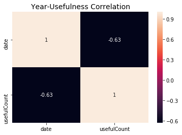


**Conclusion**: Negative correlation between years and useful counts is not strong, but it's not totally random

### ANOVA test for `usefulCount` per year


```python
import statsmodels.api as sm
from statsmodels.formula.api import ols

formula = 'usefulCount ~ C(year)'
lm = ols(formula, drugs).fit()
table = sm.stats.anova_lm(lm, typ=2)
print(table)
```

                    sum_sq        df            F  PR(>F)
    C(year)   4.104696e+07       9.0  4024.750995     0.0
    Residual  2.423410e+08  213859.0          NaN     NaN


**Conclusion**: Test shows that there is a statistically significant difference in distribution of usefulness each year, hence I reject null hypothesis

### Rating Over the Years


```python
plt.figure(figsize=(12,5))
plt.style.use('seaborn-whitegrid')
sns.barplot(x='year', y='rating', data=drugs)
plt.title('Rating Over The Years', fontSize=14)
plt.show()
```


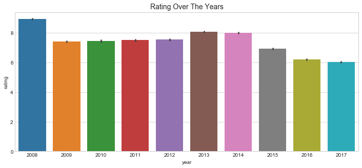


### Usefulness Over the Years


```python
plt.figure(figsize=(12,5))
sns.barplot(x='year', y='usefulCount', data=drugs)
plt.title('Usefulness Over the Years', fontSize=14)
plt.show()
```


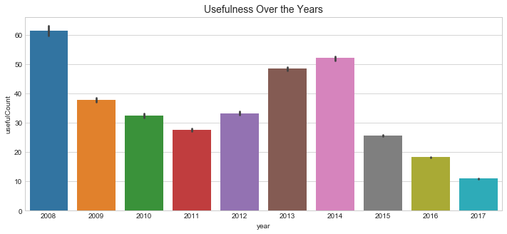


### Top 10 Drugs Usefulness Over the Years


```python
plt.figure(figsize=(16,8))

top_10_drugs = list(drugs.drugName.value_counts()[:10].keys())
for i in top_10_drugs:
    plt.plot(drugs[drugs.drugName==i].groupby('year').mean()[['usefulCount']], label=i)
    plt.legend()
```


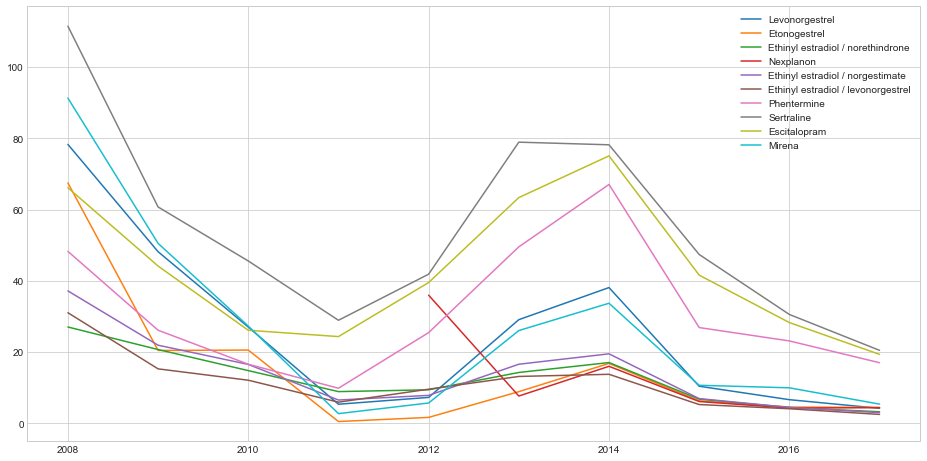


```python
sns.heatmap(drugs.groupby('year')[['rating','usefulCount']].mean().corr(), annot=True)
plt.title('Rating-Usefulness Correlation', fontSize=14)
plt.show()
```


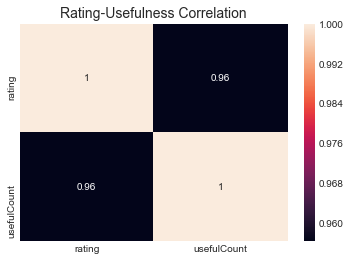


**Conclusion**: Reviews with higher rating appear to be more useful for users

### Distribution of Rating Across All Reviews


```python
plt.figure(figsize=(9,9))

rating_count = drugs.groupby('rating')['review'].count()
sizes = rating_count.values
labels = rating_count.keys()

wedges, texts, autotexts = plt.pie(sizes, labels=labels, autopct='%1.1f%%', pctdistance=0.8, labeldistance=1.1)
plt.setp(autotexts, size=12, color='w')
plt.setp(texts, size=13,)
plt.title('Ratings Proportion', fontSize=16)
plt.show()
```


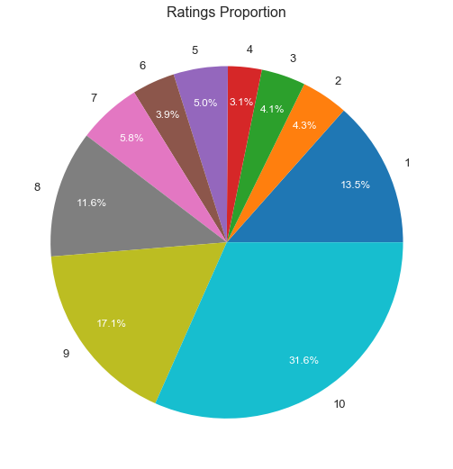


**Conclusion**: patients tend to write a review when they have very good or very bad experience with medication. Approximately 60% of reviews have positive sentiment

### Top Rated Drugs For a Condition


```python
def top_rated_drug_for_condition(condition='Depression', return_n=10):
    rating, count = [], []
    top_drugs = drugs[drugs.condition == condition].drugName.value_counts().head(return_n).keys()
    for i in top_drugs:
        rating.append(round(drugs[drugs.drugName==i].rating.mean(), 2))
        count.append(sum(drugs.drugName==i))
    return pd.DataFrame(np.array([top_drugs, rating, count]).T, columns=['Name','Rating','Count']).sort_values('Rating', ascending=False)
```


```python
top_rated_drug_for_condition('Birth Control')
```


<div>
<style scoped>
    .dataframe tbody tr th:only-of-type {
        vertical-align: middle;
    }

    .dataframe tbody tr th {
        vertical-align: top;
    }

    .dataframe thead th {
        text-align: right;
    }
</style>
<table border="1" class="dataframe">
  <thead>
    <tr style="text-align: right;">
      <th></th>
      <th>Name</th>
      <th>Rating</th>
      <th>Count</th>
    </tr>
  </thead>
  <tbody>
    <tr>
      <th>2</th>
      <td>Levonorgestrel</td>
      <td>7.39</td>
      <td>4896</td>
    </tr>
    <tr>
      <th>8</th>
      <td>Skyla</td>
      <td>7.24</td>
      <td>1076</td>
    </tr>
    <tr>
      <th>7</th>
      <td>Mirena</td>
      <td>6.62</td>
      <td>1673</td>
    </tr>
    <tr>
      <th>6</th>
      <td>Implanon</td>
      <td>6.18</td>
      <td>1506</td>
    </tr>
    <tr>
      <th>9</th>
      <td>Lo Loestrin Fe</td>
      <td>6.07</td>
      <td>914</td>
    </tr>
    <tr>
      <th>0</th>
      <td>Etonogestrel</td>
      <td>5.83</td>
      <td>4402</td>
    </tr>
    <tr>
      <th>5</th>
      <td>Ethinyl estradiol / norgestimate</td>
      <td>5.79</td>
      <td>2682</td>
    </tr>
    <tr>
      <th>4</th>
      <td>Ethinyl estradiol / levonorgestrel</td>
      <td>5.76</td>
      <td>2400</td>
    </tr>
    <tr>
      <th>3</th>
      <td>Nexplanon</td>
      <td>5.64</td>
      <td>2892</td>
    </tr>
    <tr>
      <th>1</th>
      <td>Ethinyl estradiol / norethindrone</td>
      <td>5.58</td>
      <td>3619</td>
    </tr>
  </tbody>
</table>
</div>


```python
top_rated_drug_for_condition('Depression')
```


<div>
<style scoped>
    .dataframe tbody tr th:only-of-type {
        vertical-align: middle;
    }

    .dataframe tbody tr th {
        vertical-align: top;
    }

    .dataframe thead th {
        text-align: right;
    }
</style>
<table border="1" class="dataframe">
  <thead>
    <tr style="text-align: right;">
      <th></th>
      <th>Name</th>
      <th>Rating</th>
      <th>Count</th>
    </tr>
  </thead>
  <tbody>
    <tr>
      <th>5</th>
      <td>Escitalopram</td>
      <td>7.83</td>
      <td>1739</td>
    </tr>
    <tr>
      <th>6</th>
      <td>Citalopram</td>
      <td>7.6</td>
      <td>1306</td>
    </tr>
    <tr>
      <th>0</th>
      <td>Bupropion</td>
      <td>7.48</td>
      <td>1360</td>
    </tr>
    <tr>
      <th>1</th>
      <td>Sertraline</td>
      <td>7.45</td>
      <td>1859</td>
    </tr>
    <tr>
      <th>4</th>
      <td>Pristiq</td>
      <td>7.23</td>
      <td>730</td>
    </tr>
    <tr>
      <th>3</th>
      <td>Desvenlafaxine</td>
      <td>7.21</td>
      <td>793</td>
    </tr>
    <tr>
      <th>2</th>
      <td>Venlafaxine</td>
      <td>6.83</td>
      <td>1332</td>
    </tr>
    <tr>
      <th>9</th>
      <td>Cymbalta</td>
      <td>6.63</td>
      <td>1142</td>
    </tr>
    <tr>
      <th>8</th>
      <td>Duloxetine</td>
      <td>6.62</td>
      <td>1251</td>
    </tr>
    <tr>
      <th>7</th>
      <td>Vortioxetine</td>
      <td>6.13</td>
      <td>681</td>
    </tr>
  </tbody>
</table>
</div>


# 4. Model

Deep Neural networks for classification problems based on text require some preprocessing for input layer. Each word must be transformed into token. Depends on the network, tokens would be represented as **matrix** of tokens (similar to hot encoding for categorical variables) or as **sequences**, where we preserve sentence structure.


```python
def hot_pad_sequences(text, num_words=3000, maxlen=100):    
    tokenizer = Tokenizer(num_words)
    tokenizer.fit_on_texts(list(text))
    list_tokenized_headlines = tokenizer.texts_to_sequences(text)
    return sequence.pad_sequences(list_tokenized_headlines, maxlen)
```


```python
def hot_tokenization(text, num_words=2000):
    tokenizer = Tokenizer(num_words)
    tokenizer.fit_on_texts(text)
    return tokenizer.texts_to_matrix(text, mode='binary')
```


```python
def hot_label_encoding(labels):
    le = preprocessing.LabelEncoder()
    le.fit(labels)
    labels_cat = le.transform(labels)
    return to_categorical(labels_cat) 
```

## 4.1 Predicting Condition Based on Review

### Selecting 10 most popular conditions


```python
top_10_conditions = drugs.set_index('condition').loc[drugs.condition.value_counts()[:10].keys()]
```

### Hot Tokenization


```python
X_t = hot_tokenization(top_10_conditions.lemm_review, 3000)
y = hot_label_encoding(top_10_conditions.index)
train, test, label_train, label_test = train_test_split(X_t, y, test_size=0.2, random_state=42)
```

### Building Dense Network


```python
backend.clear_session()

model = Sequential()
model.add(Embedding(3000, 100, input_length=100))
model.add(Flatten())
model.add(Dense(40, activation='relu'))
model.add(Dropout(0.1))
model.add(Dense(10, activation='softmax'))

model.compile(optimizer=optimizers.Adam(lr=0.01), loss='categorical_crossentropy', metrics=['accuracy'])
model.summary()

history = model.fit(train, label_train, epochs=30, batch_size=256, validation_split=0.1)

```


### Plot Results


```python
epochs = range(1, len(history_dict['acc']) + 1)
plt.style.use('seaborn-whitegrid')
plt.figure(figsize=(12,6))

plt.plot(epochs, history_dict['acc'], 'r', label='Training acc')
plt.plot(epochs, history_dict['val_acc'], 'blue', label='Validation acc')
plt.title('Training & validation accuracy', fontSize=14)
plt.xlabel('Epochs')
plt.ylabel('Loss')
plt.legend()
plt.show()
```


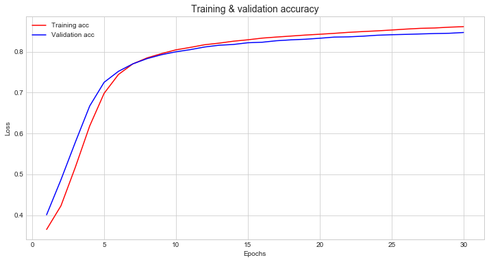


```python
plt.style.use('seaborn-whitegrid')
plt.figure(figsize=(12,6))

plt.plot(epochs, history_dict['loss'], 'g', label='Training loss')
plt.plot(epochs, history_dict['val_loss'], 'blue', label='Validation loss')

plt.title('Training & validation loss',fontSize=14)
plt.xlabel('Epochs')
plt.ylabel('Loss')
plt.legend()
plt.show()
```


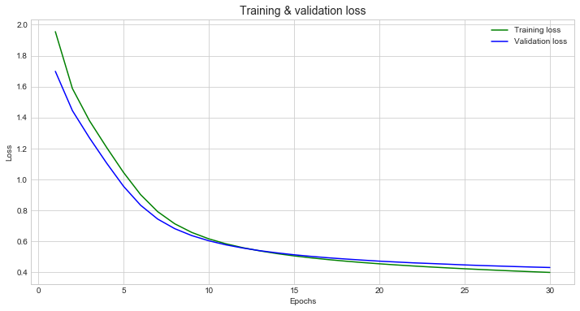


### Evaluate Performance


```python
model.evaluate(train, label_train)
```

    78978/78978 [==============================] - 12s 147us/step


    [0.39970333096838123, 0.8609992656182734]


```python
model.evaluate(test, label_test)
```

    19745/19745 [==============================] - 4s 183us/step


    [0.429464601383679, 0.8505444416307926]


### Saving Model


```python
model.save('models/top_10_conditions_30epochs.h5')
```

## 4.2 Sentiment prediction (Positive, Neutral, Negative)

Predict exact rating (1-10) from review would be very difficult and not so useful task.


```python
def rate(x):
    return 'negative' if x < 4 else 'neutral' if x >= 4 and x < 7 else 'positive'

top_10_conditions['sentiment'] = top_10_conditions.rating.map(rate)
```


```python
top_10_conditions.head()
```


<div>
<style scoped>
    .dataframe tbody tr th:only-of-type {
        vertical-align: middle;
    }

    .dataframe tbody tr th {
        vertical-align: top;
    }

    .dataframe thead th {
        text-align: right;
    }
</style>
<table border="1" class="dataframe">
  <thead>
    <tr style="text-align: right;">
      <th></th>
      <th>uniqueID</th>
      <th>drugName</th>
      <th>review</th>
      <th>rating</th>
      <th>date</th>
      <th>usefulCount</th>
      <th>year</th>
      <th>lemm_review</th>
      <th>sentiment</th>
    </tr>
    <tr>
      <th>condition</th>
      <th></th>
      <th></th>
      <th></th>
      <th></th>
      <th></th>
      <th></th>
      <th></th>
      <th></th>
      <th></th>
    </tr>
  </thead>
  <tbody>
    <tr>
      <th>Birth Control</th>
      <td>97768</td>
      <td>Cyclafem 1 / 35</td>
      <td>i have been on this birth control for one cyc...</td>
      <td>9</td>
      <td>2015-10-22</td>
      <td>4</td>
      <td>2015</td>
      <td>ive first long recommend inactive effect pills...</td>
      <td>positive</td>
    </tr>
    <tr>
      <th>Birth Control</th>
      <td>215892</td>
      <td>Copper</td>
      <td>i've had the copper coil for about months now...</td>
      <td>6</td>
      <td>2016-06-06</td>
      <td>1</td>
      <td>2016</td>
      <td>nearly want think coil faint recommend side pa...</td>
      <td>neutral</td>
    </tr>
    <tr>
      <th>Birth Control</th>
      <td>71428</td>
      <td>Levora</td>
      <td>i was on this pill for almost two years it do...</td>
      <td>2</td>
      <td>2011-04-16</td>
      <td>3</td>
      <td>2011</td>
      <td>cry years first difference husband skin make a...</td>
      <td>negative</td>
    </tr>
    <tr>
      <th>Birth Control</th>
      <td>79865</td>
      <td>Blisovi Fe 1 / 20</td>
      <td>i absolutely love this product and recommend ...</td>
      <td>10</td>
      <td>2017-11-03</td>
      <td>4</td>
      <td>2017</td>
      <td>use recommend long cramp desire since consiste...</td>
      <td>positive</td>
    </tr>
    <tr>
      <th>Birth Control</th>
      <td>60341</td>
      <td>NuvaRing</td>
      <td>i was on this for years and birth control pil...</td>
      <td>7</td>
      <td>2011-06-17</td>
      <td>0</td>
      <td>2011</td>
      <td>friend might pills together drop impactful tel...</td>
      <td>positive</td>
    </tr>
  </tbody>
</table>
</div>


### Preparing Sequences for the Model


```python
X_t = hot_pad_sequences(top_10_conditions.review)
y = hot_label_encoding(top_10_conditions.sentiment)
```


```python
train, test, label_train, label_test = train_test_split(X_t, y, test_size=0.2, random_state=42)
```

### Model


```python
backend.clear_session()

model = Sequential()
model.add(Embedding(3000, 100, input_length=100))
model.add(Conv1D(25, 5, activation='relu'))
model.add(GlobalMaxPool1D())
model.add(Dense(40, activation='relu'))
model.add(Dropout(0.1))
model.add(Dense(3, activation='softmax'))

model.compile(optimizer=optimizers.Adam(lr=0.01), loss='categorical_crossentropy', metrics=['accuracy'])
model.summary()
```

    WARNING:tensorflow:From /Users/seanbird/anaconda3/lib/python3.7/site-packages/tensorflow/python/framework/op_def_library.py:263: colocate_with (from tensorflow.python.framework.ops) is deprecated and will be removed in a future version.
    Instructions for updating:
    Colocations handled automatically by placer.
    WARNING:tensorflow:From /Users/seanbird/anaconda3/lib/python3.7/site-packages/keras/backend/tensorflow_backend.py:3445: calling dropout (from tensorflow.python.ops.nn_ops) with keep_prob is deprecated and will be removed in a future version.
    Instructions for updating:
    Please use `rate` instead of `keep_prob`. Rate should be set to `rate = 1 - keep_prob`.
    _________________________________________________________________
    Layer (type)                 Output Shape              Param #   
    =================================================================
    embedding_1 (Embedding)      (None, 100, 100)          300000    
    _________________________________________________________________
    conv1d_1 (Conv1D)            (None, 96, 25)            12525     
    _________________________________________________________________
    global_max_pooling1d_1 (Glob (None, 25)                0         
    _________________________________________________________________
    dense_1 (Dense)              (None, 40)                1040      
    _________________________________________________________________
    dropout_1 (Dropout)          (None, 40)                0         
    _________________________________________________________________
    dense_2 (Dense)              (None, 3)                 123       
    =================================================================
    Total params: 313,688
    Trainable params: 313,688
    Non-trainable params: 0
    _________________________________________________________________


### Model Training


```python
history = model.fit(train, label_train, epochs=3, batch_size=256, validation_split=0.1)
```

    WARNING:tensorflow:From /Users/seanbird/anaconda3/lib/python3.7/site-packages/tensorflow/python/ops/math_ops.py:3066: to_int32 (from tensorflow.python.ops.math_ops) is deprecated and will be removed in a future version.
    Instructions for updating:
    Use tf.cast instead.
    WARNING:tensorflow:From /Users/seanbird/anaconda3/lib/python3.7/site-packages/tensorflow/python/ops/math_grad.py:102: div (from tensorflow.python.ops.math_ops) is deprecated and will be removed in a future version.
    Instructions for updating:
    Deprecated in favor of operator or tf.math.divide.
    Train on 71080 samples, validate on 7898 samples
    Epoch 1/3
    71080/71080 [==============================] - 261s 4ms/step - loss: 0.6370 - acc: 0.7446 - val_loss: 0.5436 - val_acc: 0.7802
    Epoch 2/3
    71080/71080 [==============================] - 236s 3ms/step - loss: 0.4845 - acc: 0.8036 - val_loss: 0.4930 - val_acc: 0.8049
    Epoch 3/3
    71080/71080 [==============================] - 185s 3ms/step - loss: 0.3972 - acc: 0.8418 - val_loss: 0.4597 - val_acc: 0.8212


```python
history_dict = history.history
```

### Model Visualization


```python
epochs = range(1, len(history_dict['acc']) + 1)
plt.style.use('seaborn-whitegrid')
plt.figure(figsize=(12,6))

plt.plot(epochs, history_dict['acc'], 'red', label='Training Accuracy')
plt.plot(epochs, history_dict['val_acc'], 'orange', label='Validation Accuracy')
plt.title('Training & validation Accuracy', fontSize=14)
plt.xlabel('Epochs')
plt.ylabel('Accuracy')
plt.legend()
plt.show()
```


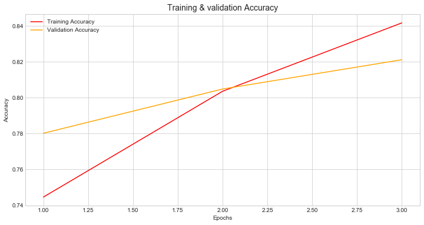


```python
epochs = range(1, len(history_dict['acc']) + 1)
plt.style.use('seaborn-whitegrid')
plt.figure(figsize=(12,6))

plt.plot(epochs, history_dict['acc'], 'green', label='Training Loss')
plt.plot(epochs, history_dict['val_acc'], 'blue', label='Validation Loss')
plt.title('Training & validation Loss', fontSize=14)
plt.xlabel('Epochs')
plt.ylabel('Loss')
plt.legend()
plt.show()
```


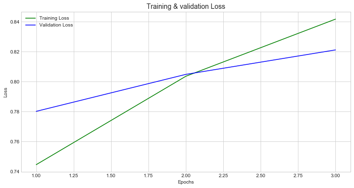


## 4.3 Predicting a Drug Based on Review

### Selecting 10 most popular drugs


```python
top_drug_for_condition = []
for i in top_10_conditions.index.unique():
    drug_name = top_10_conditions[top_10_conditions.index==i].drugName.value_counts()[:1].keys()[0]
    top_drug_for_condition.append(drug_name)
```


```python
top_drugs = pd.DataFrame()
for i in top_drug_for_condition:
    top_drugs = pd.concat([top_drugs, top_10_conditions[top_10_conditions.drugName==i]])
```

### Preparing Sequences for the Model


```python
X_t = hot_pad_sequences(top_drugs.lemm_review, 3000, maxlen=100)
y = hot_label_encoding(top_drugs.drugName)
train, test, label_train, label_test = train_test_split(X_t, y, test_size=0.2, random_state=42)
```

### Model Initialization


```python
backend.clear_session()

model = Sequential()
model.add(Embedding(3000, 80, input_length=100))
model.add(Conv1D(60, 2, activation='relu'))
model.add(GlobalMaxPool1D())
model.add(Dropout(0.1))
model.add(Dense(30, activation='relu'))
model.add(Dropout(0.1))
model.add(Dense(10, activation='softmax'))

model.compile(optimizer='adam', loss='categorical_crossentropy', metrics=['accuracy'])
model.summary()
```

    _________________________________________________________________
    Layer (type)                 Output Shape              Param #   
    =================================================================
    embedding_1 (Embedding)      (None, 100, 80)           240000    
    _________________________________________________________________
    conv1d_1 (Conv1D)            (None, 99, 60)            9660      
    _________________________________________________________________
    global_max_pooling1d_1 (Glob (None, 60)                0         
    _________________________________________________________________
    dropout_1 (Dropout)          (None, 60)                0         
    _________________________________________________________________
    dense_1 (Dense)              (None, 30)                1830      
    _________________________________________________________________
    dropout_2 (Dropout)          (None, 30)                0         
    _________________________________________________________________
    dense_2 (Dense)              (None, 10)                310       
    =================================================================
    Total params: 251,800
    Trainable params: 251,800
    Non-trainable params: 0
    _________________________________________________________________


### Training


```python
history = model.fit(train, label_train, epochs=6, validation_split=0.1, batch_size=80)
history_dict = history.history
```

    Train on 9332 samples, validate on 1037 samples
    Epoch 1/6
    9332/9332 [==============================] - 39s 4ms/step - loss: 1.7369 - acc: 0.4074 - val_loss: 1.0217 - val_acc: 0.7030
    Epoch 2/6
    9332/9332 [==============================] - 31s 3ms/step - loss: 0.6570 - acc: 0.8052 - val_loss: 0.3945 - val_acc: 0.8862
    Epoch 3/6
    9332/9332 [==============================] - 32s 3ms/step - loss: 0.3613 - acc: 0.8883 - val_loss: 0.3169 - val_acc: 0.8959
    Epoch 4/6
    9332/9332 [==============================] - 34s 4ms/step - loss: 0.2736 - acc: 0.9181 - val_loss: 0.2911 - val_acc: 0.8997
    Epoch 5/6
    9332/9332 [==============================] - 36s 4ms/step - loss: 0.2214 - acc: 0.9366 - val_loss: 0.2888 - val_acc: 0.9016
    Epoch 6/6
    9332/9332 [==============================] - 35s 4ms/step - loss: 0.1726 - acc: 0.9500 - val_loss: 0.2934 - val_acc: 0.9084


### Model Visualization


```python
epochs = range(1, len(history_dict['acc']) + 1)
plt.style.use('seaborn-whitegrid')
plt.figure(figsize=(12,6))

plt.plot(epochs, history_dict['acc'], 'r', label='Training acc')
plt.plot(epochs, history_dict['val_acc'], 'blue', label='Validation acc')
plt.title('Training & validation accuracy', fontSize=14)
plt.xlabel('Epochs')
plt.ylabel('Loss')
plt.legend()
plt.show()
```


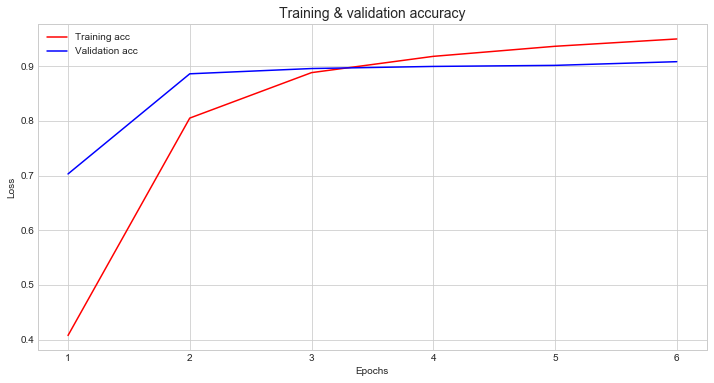


```python
plt.style.use('seaborn-whitegrid')
plt.figure(figsize=(12,6))

plt.plot(epochs, history_dict['loss'], 'g', label='Training loss')
plt.plot(epochs, history_dict['val_loss'], 'blue', label='Validation loss')

plt.title('Training & validation loss',fontSize=14)
plt.xlabel('Epochs')
plt.ylabel('Loss')
plt.legend()
plt.show()
```


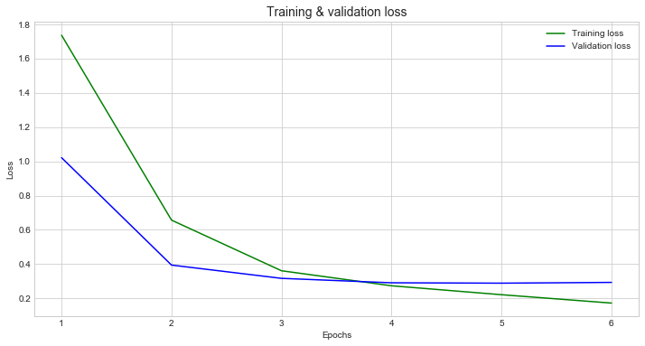


```python
model.evaluate(train, label_train)
```

    10369/10369 [==============================] - 14s 1ms/step


    [0.11550691304210813, 0.9718391358858135]


```python
model.evaluate(test, label_test)
```

    2593/2593 [==============================] - 3s 1ms/step


    [0.29553299349245304, 0.9032009255688391]


## 4.4 Predicting a Drug for Birth Control Based on Review

### Selecting Birth Control Drugs


```python
top_birthcontrol_drugs = drugs.set_index('drugName').loc[drugs[drugs.condition=='Birth Control'].drugName.value_counts()[:10].keys()]
```

### Preparing Sequences for the Model


```python
X_t = hot_pad_sequences(top_birthcontrol_drugs.lemm_review, 3000, maxlen=100)
y = hot_label_encoding(top_birthcontrol_drugs.index)
train, test, label_train, label_test = train_test_split(X_t, y, test_size=0.2, random_state=42)
```

### Hypermarameteres Tuning


```python
# Using function as a wrapper for a model to feed it into Keras Classifier with parameter we are about to tune
def create_model(dropout_rate=0.2, lr=0.01, conv_filters=25, kernel_size=5):
    backend.clear_session()
    model = Sequential()
    model.add(Embedding(3000, 80, input_length=100))
    model.add(Conv1D(conv_filters, kernel_size, activation='relu'))
    model.add(GlobalMaxPool1D())
    model.add(Dropout(dropout_rate))
    model.add(Dense(40, activation='relu'))
    model.add(Dropout(dropout_rate))
    model.add(Dense(10, activation='softmax'))
    optimizer = optimizers.Adam(lr=lr)
    model.compile(loss='categorical_crossentropy', optimizer=optimizer, metrics=['accuracy'])   
    return model
 
# Keras wrapper for skalearn `gridsearch`
model = KerasClassifier(build_fn=create_model)

# Parameters we are intersted in tuning
param_grid = dict(
                    dropout_rate = [0.1, 0.2],                
                    lr = [0.01, 0.1],
                    conv_filters = [20, 25],
                    kernel_size=[5, 10],
                    )

# Comparing models with different parameters, choosing best one
grid = GridSearchCV(estimator=model, param_grid=param_grid, n_jobs=-1)
grid_result = grid.fit(train, label_train, verbose=1, epochs=3, validation_split=0.1)

print("Best Score: %f using %s" % (grid_result.best_score_, grid_result.best_params_))
```

    Train on 9332 samples, validate on 1037 samples
    Epoch 1/3
    9332/9332 [==============================] - 28s 3ms/step - loss: 0.8207 - acc: 0.7200 - val_loss: 0.4382 - val_acc: 0.8554
    Epoch 2/3
    9332/9332 [==============================] - 25s 3ms/step - loss: 0.4195 - acc: 0.8597 - val_loss: 0.4399 - val_acc: 0.8611
    Epoch 3/3
    9332/9332 [==============================] - 26s 3ms/step - loss: 0.3415 - acc: 0.8894 - val_loss: 0.4822 - val_acc: 0.8611
    Best Score: 0.866815 using {'conv_filters': 25, 'dropout_rate': 0.1, 'kernel_size': 5, 'lr': 0.01}


### Final Model With Tuned Hyperparameters


```python
backend.clear_session()

model = Sequential()
model.add(Embedding(3000, 80, input_length=100))
model.add(Conv1D(25, 5, activation='relu'))
model.add(GlobalMaxPool1D())
model.add(Dense(40, activation='relu'))
model.add(Dropout(0.1))
model.add(Dense(10, activation='softmax'))

model.compile(optimizer=optimizers.Adam(lr=0.01), loss='categorical_crossentropy', metrics=['accuracy'])
model.summary()
```

    _________________________________________________________________
    Layer (type)                 Output Shape              Param #   
    =================================================================
    embedding_1 (Embedding)      (None, 100, 80)           240000    
    _________________________________________________________________
    conv1d_1 (Conv1D)            (None, 96, 25)            10025     
    _________________________________________________________________
    global_max_pooling1d_1 (Glob (None, 25)                0         
    _________________________________________________________________
    dense_1 (Dense)              (None, 40)                1040      
    _________________________________________________________________
    dropout_1 (Dropout)          (None, 40)                0         
    _________________________________________________________________
    dense_2 (Dense)              (None, 10)                410       
    =================================================================
    Total params: 251,475
    Trainable params: 251,475
    Non-trainable params: 0
    _________________________________________________________________


```python
history = model.fit(train, label_train, epochs=6, validation_split=0.1, batch_size=80)
```

    Train on 18763 samples, validate on 2085 samples
    Epoch 1/6
    18763/18763 [==============================] - 40s 2ms/step - loss: 1.3388 - acc: 0.4405 - val_loss: 1.0142 - val_acc: 0.5516
    Epoch 2/6
    18763/18763 [==============================] - 40s 2ms/step - loss: 1.0353 - acc: 0.5371 - val_loss: 0.9793 - val_acc: 0.5602
    Epoch 3/6
    18763/18763 [==============================] - 45s 2ms/step - loss: 0.9783 - acc: 0.5514 - val_loss: 0.9770 - val_acc: 0.5520
    Epoch 4/6
    18763/18763 [==============================] - 48s 3ms/step - loss: 0.9348 - acc: 0.5700 - val_loss: 0.9864 - val_acc: 0.5482
    Epoch 5/6
    18763/18763 [==============================] - 49s 3ms/step - loss: 0.9011 - acc: 0.5760 - val_loss: 0.9829 - val_acc: 0.5607
    Epoch 6/6
    18763/18763 [==============================] - 53s 3ms/step - loss: 0.8810 - acc: 0.5814 - val_loss: 0.9852 - val_acc: 0.5573


```python
history_dict = history.history
```


```python
epochs = range(1, len(history_dict['acc']) + 1)
plt.style.use('seaborn-whitegrid')
plt.figure(figsize=(12,6))

plt.plot(epochs, history_dict['acc'], 'r', label='Training acc')
plt.plot(epochs, history_dict['val_acc'], 'blue', label='Validation acc')
plt.title('Training & validation accuracy', fontSize=14)
plt.xlabel('Epochs')
plt.ylabel('Loss')
plt.legend()
plt.show()
```


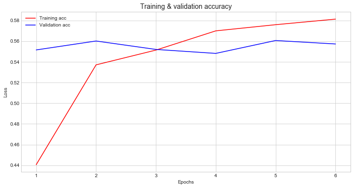


```python
plt.style.use('seaborn-whitegrid')
plt.figure(figsize=(12,6))

plt.plot(epochs, history_dict['loss'], 'g', label='Training loss')
plt.plot(epochs, history_dict['val_loss'], 'blue', label='Validation loss')

plt.title('Training & validation loss',fontSize=14)
plt.xlabel('Epochs')
plt.ylabel('Loss')
plt.legend()
plt.show()
```


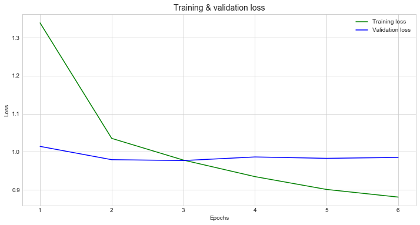


### Model Validation


```python
model.evaluate(train, label_train)
```

    20848/20848 [==============================] - 21s 991us/step


    [0.7638856178508386, 0.6176132003069839]


```python
model.evaluate(test, label_test)
```

    5212/5212 [==============================] - 5s 1ms/step


    [1.0045669936072525, 0.5496930162538863]


**Conclusion**: random guess would give 10% prediction rate, model was able to achieve 55% on testing data, which is not bad considering the fact that drugs have similar effect on patients, hence they used similar words and phrases to describe their experience.

# 5. Interpret

### Advantages of preprocessing text data
Text data was cleared from punctuation, words were lemmatized, stop words removed. This step is necessary in most cases, giving several advantages to the model:
- make model more robust (keras Tokenizer select words based on frequency, hence removing unnecessary words gives model greater ability to learn from text)
- speed up learning process (less dimensions)

### Models performance
- Predicting condition based on review worked well with 3 layers dense network, scoring 85% accuracy given 30 epochs. Learning process slowed down after 10 epochs, but kept growing with insignificant overfitting. Used 3000 based on word frequency.
- Predicting sentiment scored 80% accuracy given 2 epochs. Further training resulted in overfitting.
- Predicting drug name based on review by using convolutional network scored 90% accuracy given 6 epochs. Learning process sharply slowed down after second epoch, making model overfitting on training data.
- Predicting drug name from the same group (Birth Control) resulted in 55% accuracy by using convolutional network with hyperparameters tuning. 

# Conclusion

- Statistical analysis uncovered relationship between rating of the drug and usefulness of the review: reviews with higher rating made them more popular among readers
- Approximately 60% of all reviews have positive sentiment, 
- Most popular drugs used for birth control
- Several types of neural networks (dense, convolutional) has been trained for classification problems with average accuracy of 80%. Higher accuracy was achieved by tuning hyperparameters

# Next Steps

- Detect side effects
- Use bigrams/trigrams in training process to increase accuracy
